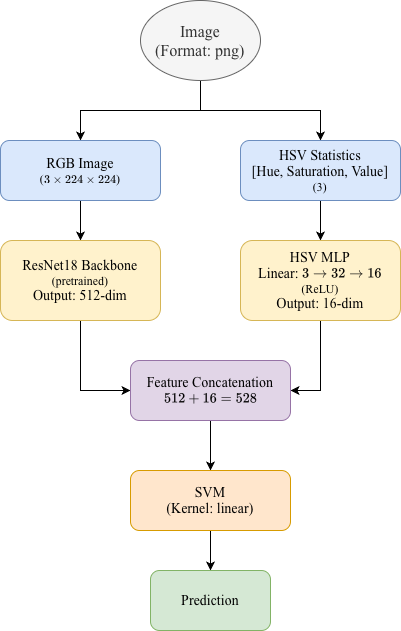
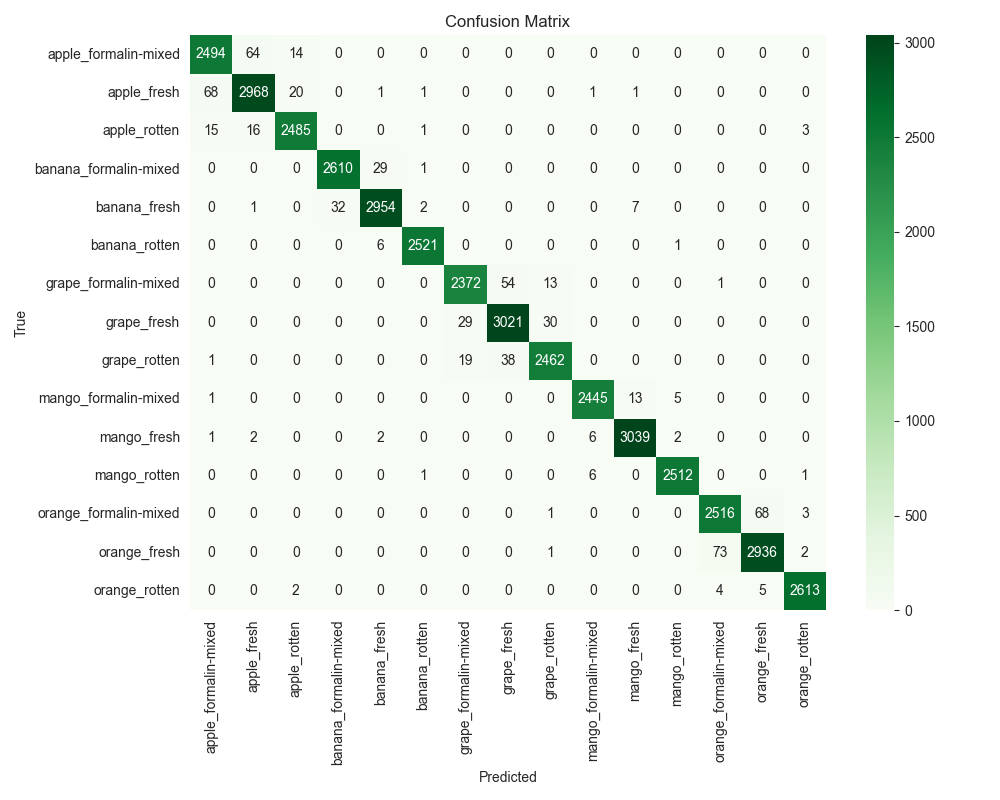

# Fruit Freshness Assessment via Multi-Feature and Hybrid Models

This project establishes an **intelligent fruit freshness identification system** based on the fusion of traditional CNNs and Large Vision-Language Models (LVLMs), balancing high precision with interpretability.

The research employs a progressive optimization strategy: starting from a **ResNet-18 baseline**, it incrementally integrates **HSV color features** and a **layer-wise unfreezing training strategy**, eventually replacing the classification head with a **Linear SVM**. The system achieves an accuracy of approximately **98.36%** across a five-class fruit classification task (Fresh/Rotten/Formalin-mixed), with an extremely low standard deviation—demonstrating exceptional stability and generalization.

---

## 🌟 Why This Project?

### 1. Human & Practical Significance
* **Standardization of Quality:** Replaces subjective human inspection with an objective, quantifiable AI grading system, ensuring consistency across the supply chain.
* **Public Health Security:** Specifically targets the detection of **"Formalin-mixed"** fruits, identifying chemical adulterations invisible to the human eye.
* **Waste Reduction:** Automates the sorting of "Fresh" vs. "Rotten" produce, optimizing logistics and reducing food waste through early decay detection.

### 2. Technical & Engineering Significance
* **Feature Robustness:** Combines **HSV color statistics** with CNN features to decouple lighting variations from actual fruit decay, mirroring human visual perception.
* **Architectural Hybridization:** Merges Deep Learning (ResNet-18) with Statistical Learning (**Linear SVM**) to maximize classification margins and improve generalization.
* **Computational Efficiency:** Implements a **"Low-Confidence Trigger"** mechanism—using a lightweight CNN for routine tasks and only invoking the Large Vision Model (LVM) for complex edge cases.
* **Engineering Rigor:** Employs **Layer-wise Unfreezing** and 5-fold cross-validation, achieving a production-ready model with high stability ($\sigma \approx 0$).

---

## 🏗 System Architecture



The project implements a **Dual-Stream Hybrid Network** that combines deep learning with traditional computer vision features:

1.  **Deep Feature Stream (ResNet-18):** Processes $224 \times 224$ RGB images to extract a **512-dim** semantic feature vector.
2.  **Color Feature Stream (HSV-MLP):** Extracts global **HSV statistics** and processes them through a 2-layer MLP ($3 \to 32 \to 16$) to capture ripeness-specific color cues.
3.  **Feature Fusion:** Concatenates both streams into a **528-dim** comprehensive feature vector.
4.  **Classification:** Utilizes a **Linear SVM** as the final decision head to maximize the classification margin and improve robustness.

## 🛠 Data Processing Pipeline

The data is from the dataset [FruitVision: A Benchmark Dataset for Fresh, Rotten, and Formalin-mixed Fruit Detection](https://data.mendeley.com/datasets/xkbjx8959c/2) in Mendeley Data, which consists of 10,154 high-resolution images of five fruit types—apple, banana, mango, orange, and grapes. The images are classified into three key categories: fresh, rotten, and formalin-mixed. 

A rigorous preprocessing and augmentation pipeline was implemented to ensure the model's robustness against real-world environmental variations.

### 1. Geometric Standardization (Square Padding)
To avoid aspect ratio distortion during resizing, all images underwent a **Square Padding** process. 
* Original images of varying dimensions were padded with white borders to form a $1:1$ aspect ratio.
* Images were then downsampled to $224 \times 224$ pixels, preserving the structural integrity of the fruit shapes.

### 2. HSV Feature Engineering
Unlike the RGB color space, which is highly sensitive to lighting intensity, the **HSV (Hue, Saturation, Value)** model decouples color information from brightness.
* **Hue & Saturation:** Captured the biological decay and chemical treatment (Formalin) indicators.
* **Value:** Isolated lighting variations.
* We extracted global HSV statistics (mean values) to serve as a 3-dimensional "color signature" for the MLP branch.

### 3. Data Augmentation
To improve generalization and prevent overfitting, the training set was expanded by **400%** using a stochastic augmentation pipeline:
* **Rotation:** Randomly rotated within $[-25^\circ, 25^\circ]$.
* **Brightness Adjustment:** Scaled by a factor of $[0.7, 1.4]$ to simulate different indoor/outdoor lighting.
* **Salt-and-Pepper Noise:** $1\%$ density added to simulate sensor grain and transmission interference.
* **Horizontal Flip:** Applied randomly to ensure orientation invariance.

## ⚙️ Training Strategy & Optimization

The training process was designed to maximize convergence speed and model stability through advanced fine-tuning techniques and hardware-specific optimizations.

### 1. Progressive Fine-Tuning (Layer-wise Unfreezing)
To effectively leverage pre-trained weights while adapting to the specific nuances of fruit decay, we employed a staged training strategy:
* **Initial Phase:** The backbone (ResNet-18) was partially frozen. We focused on training the **HSV-MLP branch** and the **SVM classification head** to establish a baseline for color-feature integration.
* **Refinement Phase:** High-level semantic layers (e.g., `layer4` of ResNet) were unfrozen. This allowed the model to fine-tune its perception of complex textures (like mold or chemical residue) without destroying the foundational geometric features learned on ImageNet.

### 2. Robustness Validation (5-Fold Stratified CV)
Instead of a single train/test split, we utilized **5-Fold Stratified Cross-Validation**:
* This ensured that each fold maintained the same class distribution as the original dataset.
* The final reported accuracy (**98.36%**) is the mean across all folds, ensuring the results are statistically significant and not biased by a specific data partition.

### 3. Hardware Acceleration & Efficiency
The project was optimized for high-performance training on **Apple Silicon (MPS)**:
* **MPS Backend:** Leveraged the Metal Performance Shaders for GPU acceleration on Mac hardware.
* **Mixed Precision Training:** Utilized `torch.cuda.amp` (autocast) logic, which reduced the per-epoch training time from **25 minutes to approximately 3 minutes** while maintaining full numerical precision for critical weights.

### 4. Hyperparameters
* **Optimizer:** Adam / AdamW (configured for weight decay to prevent overfitting).
* **Criterion:** Cross-Entropy Loss (during the deep learning phase) followed by SVM Margin Loss.
* **Batch Size:** Optimized for GPU memory throughput.
* **Regularization:** Dropout ($p=0.5$) and Batch Normalization were used in the fusion layers to enhance generalization.

## 📊 Results and Evaluation

The model was evaluated using **5-Fold Stratified Cross-Validation** to ensure the stability of the results. The following table illustrates the progressive performance gains achieved through our hybrid architectural choices.

### 1. Ablation Study
By incrementally adding HSV features, unfreezing strategy, and the SVM classifier, the model performance improved from a baseline of 96.21% to a peak of **98.36%**.

| Method | Accuracy | Precision (Macro) | Recall (Macro) | F1-Score (Macro) |
| :--- | :---: | :---: | :---: | :---: |
| CNN Only (ResNet-18) | 96.21% (±0.65) | 96.38% | 96.22% | 96.25% |
| CNN + HSV Features | 96.45% (±0.18) | 96.60% | 96.49% | 96.50% |
| + Layer-wise Unfreezing | 96.88% (±0.22) | 96.99% | 96.95% | 96.92% |
| **+ Linear SVM (Final Model)** | **98.36% (±0.08)** | **98.39%** | **98.37%** | **98.38%** |

### 2. Generalization Performance
To verify the model's real-world applicability, we tested the final **CNN + HSV + SVM** architecture on an independent **External Dataset**.
* **High Accuracy:** Maintained **98.07%** accuracy, proving the model does not suffer from dataset bias.
* **Low Variance:** The standard deviation remained extremely low ($\sigma = 0.0008$), indicating exceptional consistency across different data folds.



## 🚀 How to Run

### Step 1: Clone the Repository
```
git clone
cd Fruit_Freshness_Assessment
```

### Step 2: Prepare the Data
* Download the dataset from [Mendeley Data](https://data.mendeley.com/datasets/xkbjx8959c/2) and extract the zip file.
* Move it to the `data` directory according to the `README.md` in it.

### Step 3: Install Required Packages and Train the Model
```
chmod +x run_pipeline.sh
./run_pipeline.sh
```